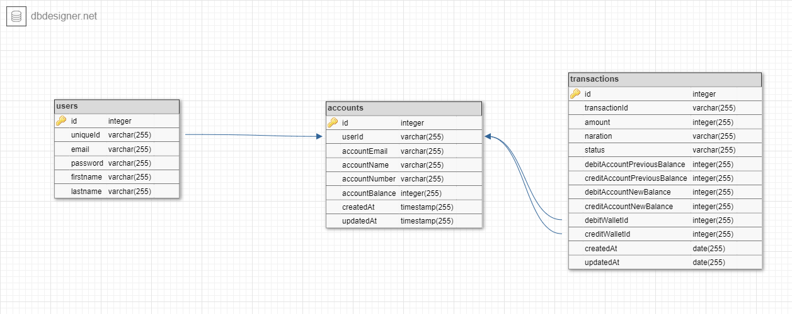

## About

Demo Credit is a mobile lending app that requires wallet functionality. This is needed as borrowers need a wallet to receive the loans they have been granted and also send the money for repayments built with Node js, Express, TypeScript and Mysql

It has the following functionalities

* A user can create an account
* A user can fund their account
* A user can transfer funds to another user’s account

### ER diagram



## Installation

* Clone this repo

  ```bash
  git clone https://github.com/princeadeyeye/simple-lending-api.git
  ```

## Running the project

1. Install and start .
2. create the `.env.development.local`, `.env.production.local`, `.env.test.local` template file. Input the passwords and app secrets.

3. Build and run the backend services.

```bash
npm run start
```

4. Run migrations

```bash
  npm run migrate
```

5. Seed database

```bash
  npm run seed 
```

You can visit the app by going to `http://localhost:3000`.

### Built with

#### Backend

* [Mysql](https://www.mysql.com/) - Database
* [Knex js](https://knexjs.org/) - The Query Builder for Node.js
* [Objection js](https://vincit.github.io/objection.js/) - The ORM for Node.js
* [Express.js](https://expressjs.com/) - Lightweight webserver
